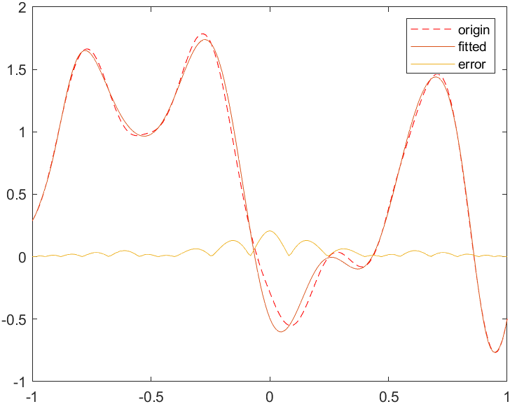
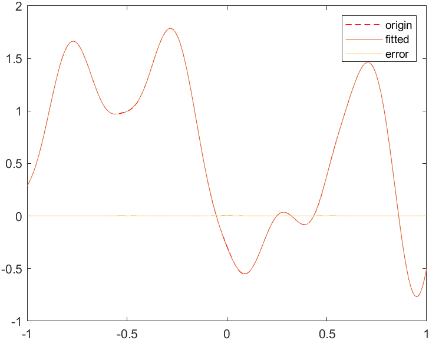
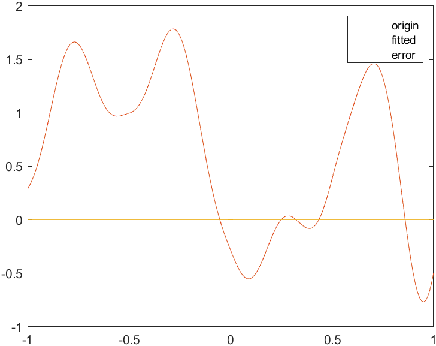
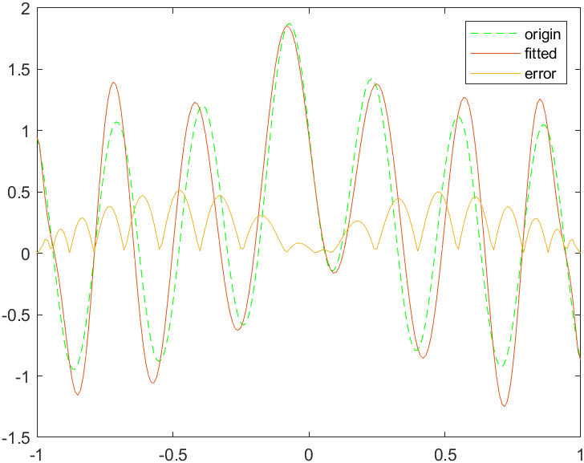
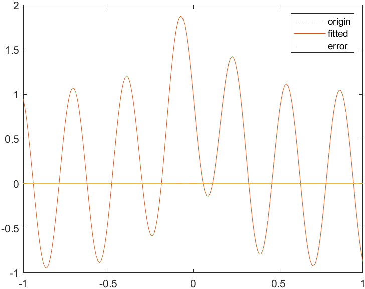
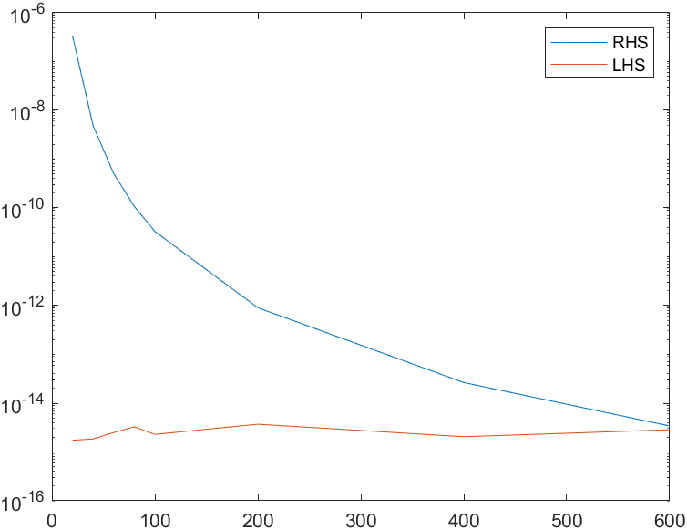
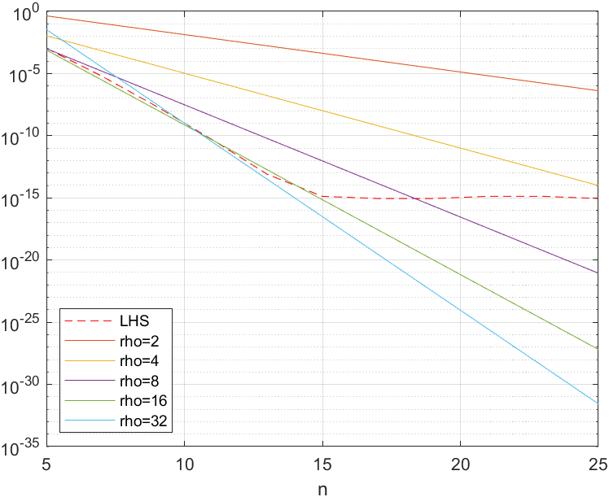
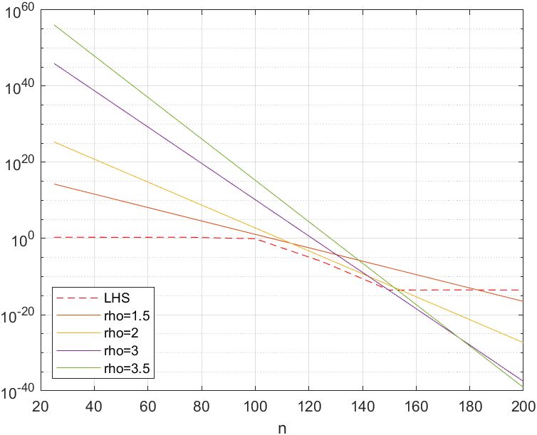

# Chebyshev插值

## Problem

实现切比雪夫插值，并验证切比雪夫插值多项式的逼近效果，完成以下内容：

1、选择 20,40,60,80 个切比雪夫节点在 $x \in [−1,1] $上插值下列函数，并绘制原函数与插值函数。
$$f_1(x)=|sin(6x)|^3-cos(5e^x)$$
$$f_2(x)=\frac{1}{1+25x^2}-sin(20x)$$

2、选择合适的节点数，证明切比雪夫插值多项式的逼近结果，验证下述定理。

#### differentiable functions

for an integer $m \geqslant 0$ , let f and its derivatives through $f^{(m-1)}$ be absolutely continuous on the interval $[-1,1]$. and suppose the m th derivative $f^{(m)}$ is of bounded variation V. then $k\geqslant m+1$, the chebyshev coefficents of f satisfy

$$|c_k|\leqslant \frac{2V}{\pi (k-m)^{m+1}}$$

and the chebyshev interpolants satisfy 
$$||f-p_n||\leqslant \frac{4V}{\pi m(n-m)^m}$$

#### holomorphic functions

let a function f analytic in $[-1,1]$ be analytically continuable to and bounded by $M$ in an open Bernstein ellipse $E_\rho$. the Bernstein ellipse is an ellipse with foci at $\pm 1$ and the length of the semimajor axis plus the length of the semiminor axis is $\rho$.
 the chebyshev coefficients of f satisfy

$$|c_0|\leqslant M$$
$$|c_k|\leqslant 2M\rho ^{-k}$$

 and the chebyshev interpolants satisfy

$$||f-p_n||_{\infty} \leqslant \frac{4M\rho ^{-n}}{\rho -1}$$

## Algorithm

k阶Chebyshev多项式为
$$T_k(cos x)=cos kx$$

给定$f(x)$，令
$$x_k=cos\frac{k \pi}{n},y_k=f(x_k),k=0,1,...,n$$

计算
$$y_{2n-k}=y_{k},k=1,2,...,n-1$$

利用离散傅里叶变换计算
$$\{ {y_0,y_1,...y_{2n-1}}\}\rightarrow\{ {Y_0,Y_1,...Y_{2n-1}}\}$$

那么有
$$a_k=\frac{Y_k}{n},a_0=\frac{Y_0}{2n},a_n=\frac{Y_n}{2n}$$

$f(x)$的Chebyshev插值公式为
$$f(x)=\sum_{k=0}^{n}a_k T_k(x)$$

## Result
### 插值效果
#### $f_1(x)$的Chebyshev插值结果
<figure>

</figure>

#### $f_2(x)$的Chebyshev插值结果
<figure>

</figure>

#### Theorem 2 验证效果

简单起见，$f(x)=sin (x)$在$[-1,1]$上有任意阶连续导数，且其绝对值上界为1. 定理中$m$可任意取，$V=1,n\geqslant k\geqslant m+1$.

本次作业中$m=5,n=[20,40,60,80,100,200,400,600];$其中bool数组元素表示不符合$|c_k|\leqslant \frac{2V}{\pi (k-m)^{m+1}}$的个数，在$n=600$时
会出现11个异常点，大约是$10^{-17}$左右，可能是由于机器精度导致的误差。

<figure>

</figure>

#### Theorem 3 验证效果

Bernstein ellipse 在复平面上的半长轴和半短轴分别为$a=\frac{\rho +\rho ^{-1}}{2},b=\frac{\rho - \rho ^{-1}}{2}$。

函数$f(x)=e^x,g(x)=cos(100 x)$均为复平面上的整函数，满足题设条件，现对其验证Theorem3.

对应的图像如下，其中$LHS=||f-p_n||_{\infty},RHS=\frac{4M\rho ^{-n}}{\rho -1}$，使用向量范数（最大误差）来代替函数的无穷范数

$$M(f)=e^{\frac{\rho +\rho ^{-1}}{2}},\rho=2,4,8,16,32$$

$$M(g)=cosh(100 \frac{\rho -\rho ^{-1}}{2}),\rho=1.5,2,3,3.5$$

<figure>

</figure>

<figure>

</figure>

## Analysis

Chebyshev插值在$[-1,1]$上的数据拟合效果较好，且用于插值的多项式次数越高，与原函数的图像越接近，拟合效果越好。
在其他区间上的插值需要做一定的变换。

Chebyshev插值得到的数据基本满足所需验证的两个定理，在$10^{-16}$左右误差不再减少，基本保持在机器精度范围内。

验证Theorem3时，当$f(x)=e^x,\rho =32$时，在误差为$10^{-9},n=10$之后出现不满足定理的情况，推测是由于
Chebyshev插值在计算过程中由于机器精度误差影响，在多项式次数为15阶时已经得到在机器精度下较好的插值函数。

同理，$g(x)$的插值函数在多项式次数为150阶时已经得到在机器精度下较好的插值函数

## Code Instruction

使用MATLAB计算fft时，会由于误差导致计算出的
$a_n \in \mathbb{C}$ ，但实际上计算结果均为实数，直接取其实部即可。